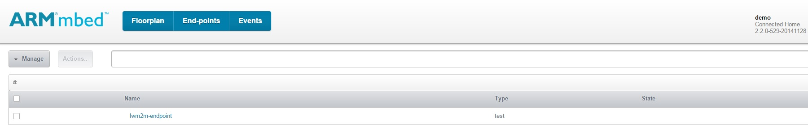
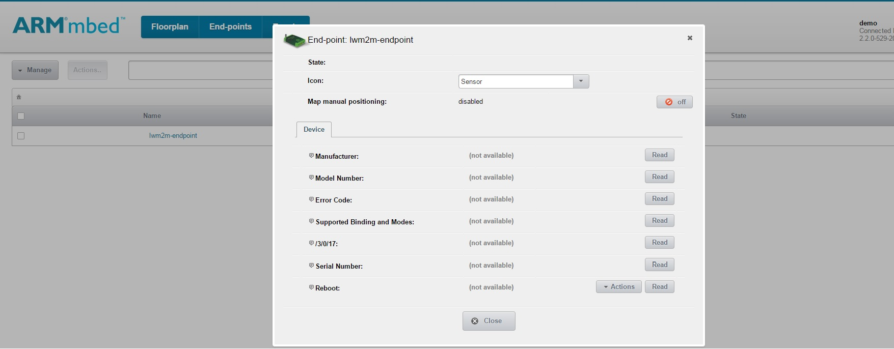
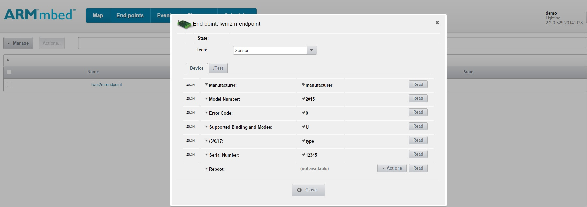
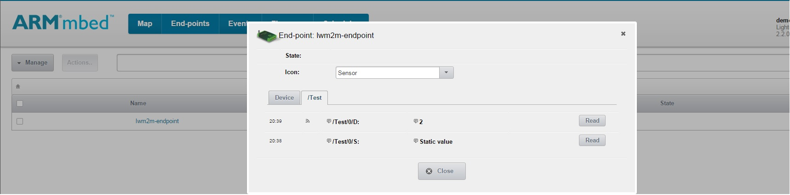
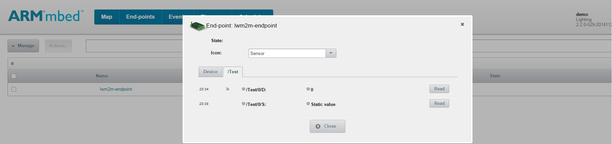

# Getting started on LWM2M Client Example

This document describes briefly the steps required to start using the LWM2M Client example application on Linux platform. The LWM2M Client example application demonstrates how to register, unregister, read resource values and send resource observations to the mbed Device Server.

## Required hardware

* 64 bit Ubuntu/XUbuntu OS desktop environment 

## Required software

* [yotta](http://docs.yottabuild.org/#installing) - to build the example programs.
* [mbed Device Server (mDS)](#download-mbed-device-server-mds) - the LWM2M Client example connects to mDS.

## Optional software
* [Wireshark](https://www.wireshark.org/) - for packet inspection/network debugging.

## Setting up the environment

To set up the environment, you will need to do the following:

1. Download and run mDS server on computer.
2. Configure the LWM2M Client example program with the server address.
3. Build the application with Yotta.
4. Load the application to the FRDM-K64F board.
5. Plug the ethernet cable to the board.
6. Verify that the board communicates with the server.

**Note:** You might need to open UDP port 5683 in your computer firewall for mDS to communicate with this example application.

### Downloading mbed Device Server (mDS)

The example application will register to mbed Device Server. Install mDS on your local computer.

1. The free developer version of the mbed Device Server is used with this example. Download it from [ARM silver](https://silver.arm.com/browse/SEN00).
2. Unzip the package on your local computer. You should see the following files:
```
Device Server.tar.gz
Device Server Clients.tar.gz
Device Server Tools.tar.gz
Ref Apps.tar.gz
```

### Starting the mbed Device Server (mDS)

1. Go to the `bin` folder of the Device Server package that you downloaded.
2. Run the start script:
    - If you are using Linux OS, run the `runDS.sh` in a new shell.
    - If you are using Windows, run the `runDS.bat` in a new command prompt.
		
This will start the mbed Device Server on your system.
		
### Starting the WebUI ("Connected home" reference app)

1. Go to the `bin` folder in the Connected-home-trial reference app that you downloaded.
2. Run the start script:	
    - If you are using Linux OS, run the `runConnectedHome.sh` in a new shell.	
    - If you are using Windows, run the `runConnectedHome.bat` in a new command prompt.	
		
This will start the WebUI on your system.	
		
## mbed Build instructions		
		
### Building

1. Install yotta. See instructions [here](http://docs.yottabuild.org/#installing).
2. Install the necessary toolchains (`arm-none-eabi-gcc`). Refer to the yotta installation instructions (in step 3) to learn how to install the toolchains.
3. In the command prompt, `cd lwm2m-client-example`.
5. Open file `main.cpp`, edit your mbed Device Server's Ipv4 address and port number in place of `coap://<xxx.xxx.xxx.xxx>:5683`. For example, if your server's IP address is `192.168.0.1`, you would enter `coap://192.168.0.1:5683`.
6. Set up the target device, `yotta target x86-linux-native`.
7. In the command prompt, type `yotta build`. The executable file will be created to `/build/x86-linux-native/source/` folder.

### Running the LWM2M Client example

1. Find the executable file named `lwm2m-client-example.exe` in the folder `lwm2m-client-example/build/x86-linux-native/source/`. 
2. Run the executable from command line using `./lwm2m-client-example`
3. The program begins execution and will start registration to the mbed Device Server giving console output as `Registering endpoint` and when the registration is successful it will display `Registered`.
4. After a successful registration, the program will automatically start sending observations after every 10 seconds and it will be visible on console as `Sending observation` along with the value which increments everytime the obeservation is sent like `Value sent 1` and so on. These values can be observed on mbed Device Server WebUI under **/Test/0/D** resource.

## Testing

### Logging network traffic (optional)

1. Start Wireshark on the computer where the mbed Device Server is running.
2. Select your ethernet interface, usually "Local Area Connection".
3. Click **Start**.
4. Select the "Filter" field in the toolbar and add a filter to correspond to your mbed Device Server. Press Enter after you have entered the expression to activate the filter.
  - For example, if your server's IP address is `123.123.123.123`, you would enter `ip.addr == 123.123.123.123` and press Enter.
5. Power up your mbed board and press the **RESET** button.

You should see the endpoint once it has registered with the mbed Device Server.

### Testing the LWM2M Client example application with the mbed Device Server

Ensure that the mDS and the WebUI are running (see [Setting up the environment](#setting-up-the-environment)). Also, ensure that the program is running on your linux desktop (see [Running the lwm2m client example](#running-the-lwm2m-client-example)).

Step 1: To open the WebUI, navigate to `http://localhost:8083`.
    - If you are working from a remote machine, you need to use the host machine's IP address instead of "localhost".

Step 2: Enter `demo` as both the username and password.

Step 3: Go to the **End-points** tab. After a short time your device should appear in the list (refresh the page to update the list).



Step 4: Click the endpoint name to view the registered resources. 



Step 5: To make a CoAP request to node resources, click **Read**.



The **/Test** tab contains resources demonstrating dynamic and static resource functionality. 

The **/Test/0/D** represents the dynamic resource observed by the mbed Device Server. It is linked with the program as it is automatically sending observations after every 10 seconds (once the registration is done). The values are updated to the UI without a need to press **Read**.



The **/Test/0/S** represents the static resource that is a fixed value set in the mbed Client. To make a CoAP request to the node resources, click **Read**. This returns the fixed value of "Static value".



To stop and unregister the LWM2M Client example, you need to interrupt the program by selecting CTRL+C, for which the console will display `Unregistering endpoint`.This will send an unregister message to mbed Device Server. After a successful unregistration, the console will display `Unregistration done --> exiting` and it will terminate the program. Also, the endpoint will disappear from the endpoint list of the WebUI.
